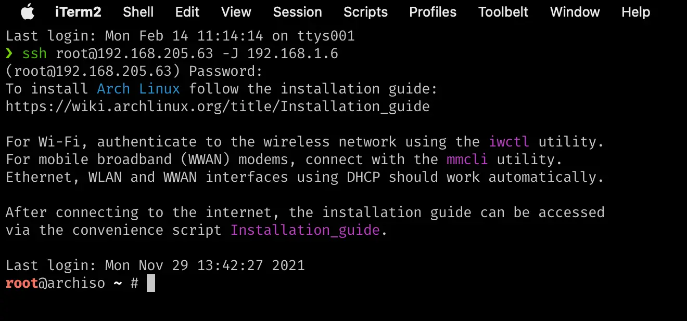

> 注：要是你的机器时缺少 EMT64 微码，而不是基于 32 位 EFI 的话，这个办法大概没法帮你启动 64 位系统
>
> BIOS 缺少 EMT64 微码的情况大概像这样子
>
> 

## 起因

在某鱼上收了个 z3735f 灵车小主机，收到之后内置 32 位 Win10 系统，然后我是要装 Arch Linux 的。进 BIOS 发现只支持 UEFI，而我只做了 Arch 的安装 U 盘怎么也无法启动。于是进入了 UEFI Shell 手动引导启动 EFI 文件


啊这啊这，这个 UEFI 竟然是 32 位的。但是 CPU 是 64 位的。查了一下，还是有办法启动 64 位系统的。

查了各路资料，有说可以使用 32 位 GRUB 启动 64 位系统的，也有说拿装黑苹果用的 clover 来干这个事情的（雾

最后还是在 Arch 的论坛上找到了基本的操作方法

首先我们需要一台正在运行 Linux 的电脑

## 创建 Arch 安装 USB 并调整 EFI 分区大小

制作 Arch USB 的方法当然是直接使用 [balenaEtcher](https://www.balena.io/etcher/) 写入镜像

然后写入完的 U 盘将包含 ISO9660 和 FAT16 (EFI) 两个分区。那个 EFI 分区虽然有可用空间但是很小，还不够我们安装 GRUB

所以我们先把 EFI 分区里面的东西全都复制出来，把那个分区删掉并创建一个大一点的 EFI 分区，然后把文件再送回去

## 创建 GRUB EFI 可执行文件

我们需要制作一个独立的 32 位 GRUB 可执行 EFI 文件。它会把所需要的依赖以及查找配置文件的路径打包到 EFI 文件里面。

懒人可以直接跳过这一步，[下载](https://wwi.lanzouw.com/iOSPi0064h4h)我做好的 EFI 文件并放入上一步 EFI 分区中的 `EFI/BOOT/` 目录中

这里假设上一步的 EFI 分区挂载在了 `/mnt`

```bash
cmdpath='(hd1,msdos2)/EFI/Boot' # 这应该是在这个目录找配置文件
echo "configfile ${cmdpath}/grub.cfg" > /tmp/grub.cfg
grub-mkstandalone -d /usr/lib/grub/i386-efi/ -O i386-efi --modules="part_gpt part_msdos" --locales="en@quot" --themes="" -o "/mnt/EFI/BOOT/bootia32.efi" "boot/grub/grub.cfg=/tmp/grub.cfg" -v
```

然后还可以参考[这里](https://wiki.archlinux.org/title/Unified_Extensible_Firmware_Interface_(%E7%AE%80%E4%BD%93%E4%B8%AD%E6%96%87)#%E5%9C%A8_32_%E4%BD%8D_UEFI_%E4%B8%8A%E5%90%AF%E5%8A%A8_64_%E4%BD%8D%E5%86%85%E6%A0%B8)创建一个 GRUB 的配置文件。但是大概没必要，创建了可能也没有用，因为我也不知道我这个 U 盘插上去会是 `(hd1,msdos2)` 还是什么。我创建了就没有用。不如用 GRUB 命令行手动启动

## 启动 ArchISO

将 USB 插到目标电脑上启动，应该能够顺利进入 GRUB 命令行界面。

然后，我们用以下命令应该就可以启动 ArchISO 界面了


你需要将 `(hd0, msdos2)` 替换为你刚才那个 EFI 分区的位置。可以用 `ls (hd0, msdos2)` 这样的命令来检查里面的文件。以及 `202112` 换成 ArchISO 的版本

```bash
root=(hd0, msdos2)
linux /arch/boot/x86_64/vmlinuz-linux archisobasedir=arch archisolabel=ARCH_202112 add_efi_memmap
initrd /arch/boot/x86_64/initramfs-linux.img
boot
```

不出意外的话，就可以进入 ArchISO 界面啦

## 小提示

如果你局域网内还有一台已经装好操作系统的电脑的话，可以打开 ArchISO 的 SSH，然后就可以直接从其他设备访问 ArchISO 的 shell 啦。这样可以方便复制粘贴命令qwq

```bash
passwd
systemctl start sshd
ip addr
```

```bash
ssh root@机器的 IP
```




## 安装系统的最后一步

~~凌莞可是做过装 Arch 没有装 Bootloader 然后重新进入 ArchISO 安装这样的事情的（x~~

应该是必须使用 GRUB，然后安装的时候使用以下命令安装 32 位版本

```bash
pacman -Sy grub efibootmgr # 不要忘记 efibootmgr 哦
grub-install --target=i386-efi --efi-directory=/boot --bootloader-id=GRUB
```

正常创建 GRUB 配置文件，之后重启就可以正常进入 64 位系统啦

## 参考资料

- [Boot usb for efi in 32 bits](https://bbs.archlinux.org/viewtopic.php?id=240314)
- [Unified Extensible Firmware Interface (简体中文)](https://wiki.archlinux.org/title/Unified_Extensible_Firmware_Interface_(%E7%AE%80%E4%BD%93%E4%B8%AD%E6%96%87)#%E5%9C%A8_32_%E4%BD%8D_UEFI_%E4%B8%8A%E5%90%AF%E5%8A%A8_64_%E4%BD%8D%E5%86%85%E6%A0%B8)
- [GRUB (简体中文)](https://wiki.archlinux.org/title/GRUB_(%E7%AE%80%E4%BD%93%E4%B8%AD%E6%96%87)/Tips_and_tricks_(%E7%AE%80%E4%BD%93%E4%B8%AD%E6%96%87)#%E7%8B%AC%E7%AB%8B%E7%9A%84_GRUB)
