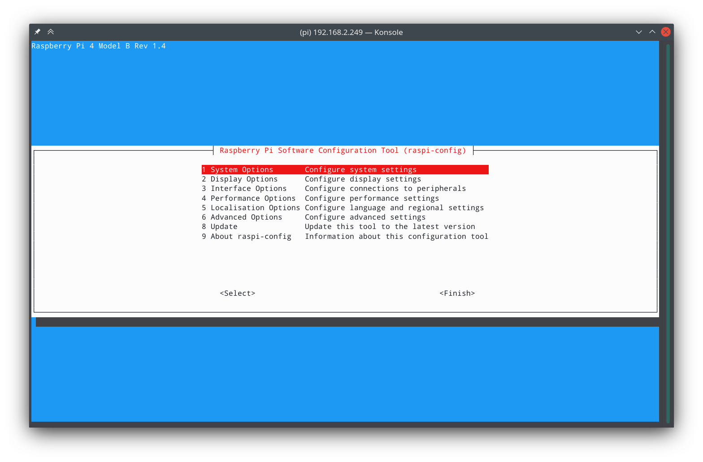
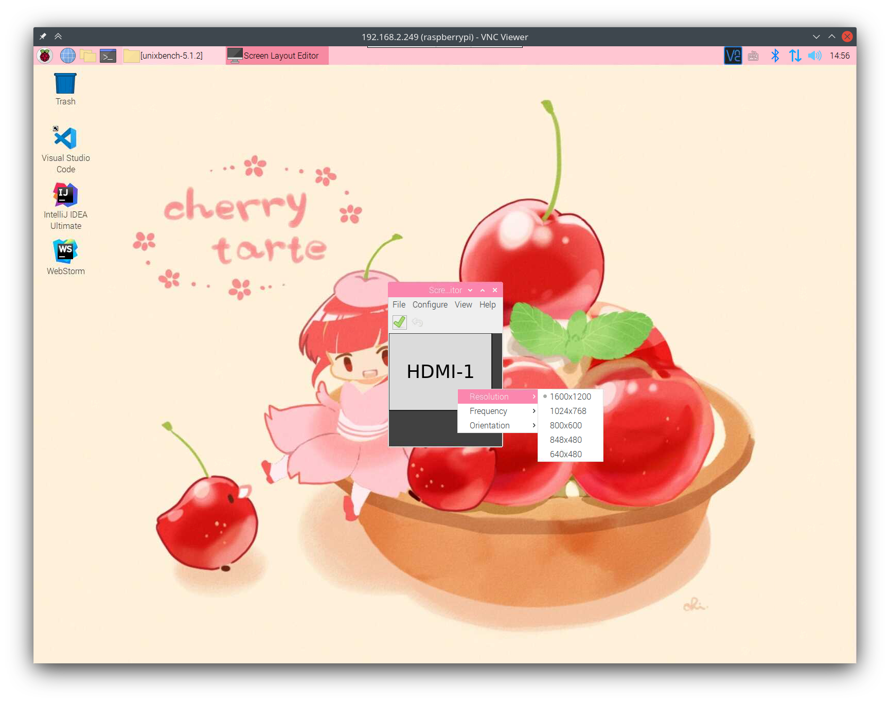
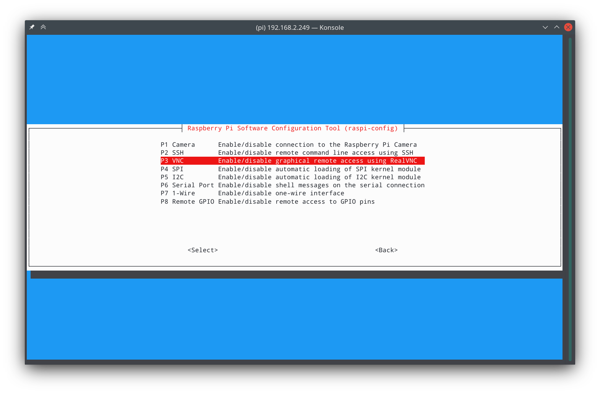
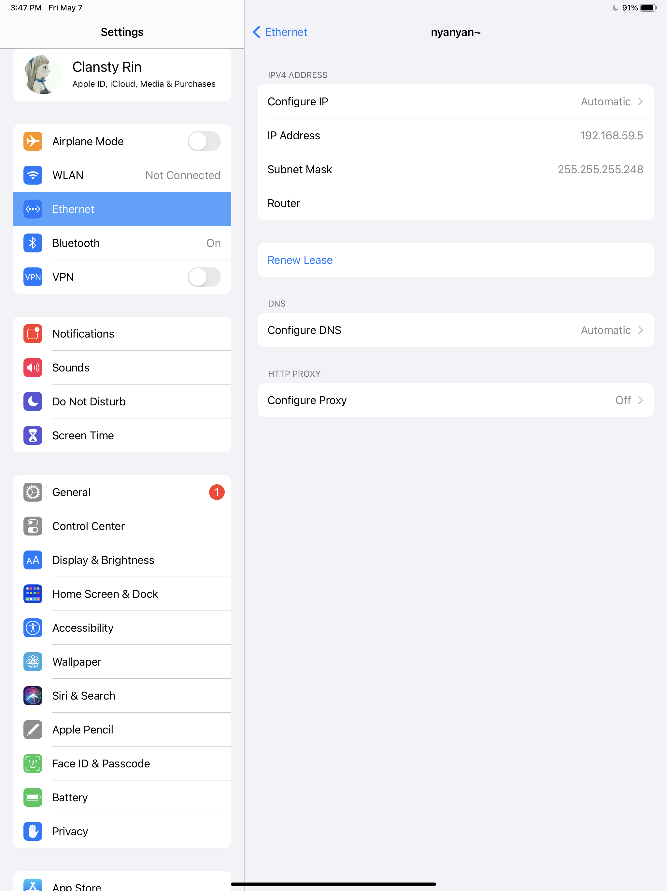
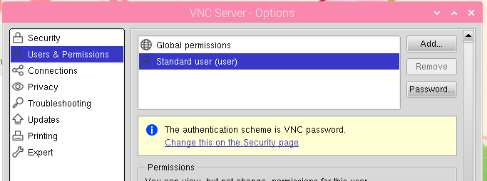
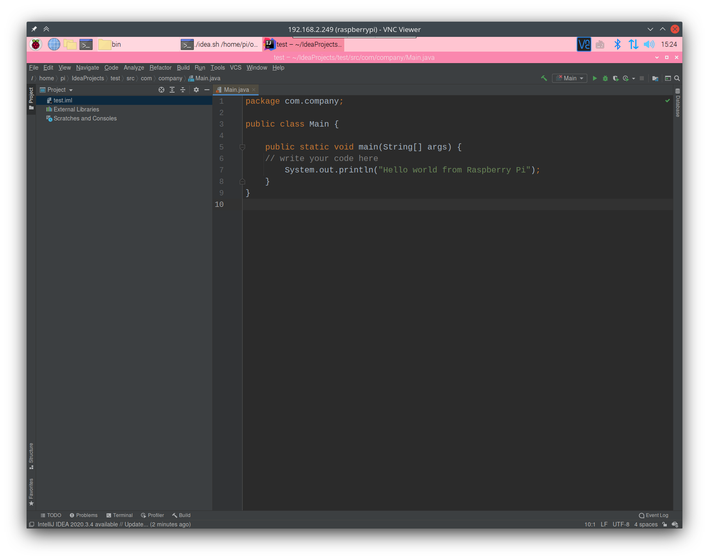

自从我在组了台式之后，笔记本（Surface Book 3）就开始吃灰了，垃圾的 Linux 兼容性以及充满 bug 的 Win10 让我几个星期都不会去开它，除非要在外面使用。而我在外面的时候一般只需要用笔记本写写简单的代码，一个树莓派的性能足够我用了。于是笔记本就被送上了闲鱼，再也不用每周开机 `Syu` 一次了

> PS. 不建议买 Surface，即使你准备用 Windows

并且，随着 iPad 越来越强大，可以连接键盘鼠标，可以分屏，可以画画，为啥不能在我在外面的时候用它来代替笔记本呢。于是我用 iPad，树莓派与蓝牙键鼠组成了一台能让我在外面的时候开 IDEA 写代码的电脑


# 构想

通过 USB-C 线把 iPad 和树莓派连接，iPad 给树莓派供电，并且建立一个 iPad 与树莓派共同的子网使得 iPad 能通过 SSH 和 VNC 访问树莓派的系统

（由于 iOS 的限制，iPad 无法共享网络给树莓派）

# 实践

整个操作大概需要电脑和路由器这两个额外的东西

## 0x00 准备系统

首先当然是给树莓派准备一个系统卡，需要带桌面的 raspbian 系统。当然别的系统应该也可以，等咱以后试（呱）了。刷好镜像之后最好在 boot 分区的根目录创建一个叫 `ssh` 的空文件夹，这样子就算没有显示器也可以远程通过 ssh 来操作树莓派了

然后把树莓派和电脑接入同一个子网并启动

## 0x01 配置 USB 主机

启动之后我们先通过 ssh 来连接树莓派的终端。当然用显示器+键盘鼠标也是可以。树莓派的默认用户名和密码是 `pi` 和 `raspberry`

我们需要创建一些配置文件来开启树莓派的**网卡模式**，使得树莓派和 iPad 连接之后能给 iPad 分配一个 IP 地址

首先安装 dnsmasq，它提供 DHCP 服务器

```bash
sudo apt update
sudo apt install dnsmasq
```

接着我们需要在驱动层面配置树莓派的 USB 接口为从端设备

- 在`/boot/config.txt`末尾写入`dtoverlay=dwc2`

- 在`/boot/cmdline.txt`末尾写入`modules-load=dwc2`
- 在`/etc/modules`末尾写入`libcomposite`

然后进行接口设备和 IP 分配的设置

- 在`/etc/dhcpcd.conf` 末尾写入`denyinterfaces usb0`

我们的网络接口就叫做 `usb0`

创建 `/etc/dnsmasq.d/usb`

```ini
interface=usb0
dhcp-range=192.168.59.2,192.168.59.6,255.255.255.248,1h
dhcp-option=3
leasefile-ro
```

`dhcp-range` 那行可以选择自己喜欢的 IP 段

创建 `/etc/network/interfaces.d/usb0`

```bash
auto usb0
allow-hotplug usb0
iface usb0 inet static
  address 192.168.59.1
  netmask 255.255.255.248
```

`192.168.59.1` 将是树莓派的 IP，要和上面填写的在同一个 IP 段

然后你需要随便找个地方创建一个 shell 脚本文件，并给那个文件**执行权限**。这个脚本将在每次开机时配置从端设备的信息。内容如下

```bash
#!/bin/bash
cd /sys/kernel/config/usb_gadget/
mkdir -p pi4
cd pi4
echo 0x1d6b > idVendor # Linux Foundation
echo 0x0104 > idProduct # Multifunction Composite Gadget
echo 0x0100 > bcdDevice # v1.0.0
echo 0x0200 > bcdUSB # USB2
echo 0xEF > bDeviceClass
echo 0x02 > bDeviceSubClass
echo 0x01 > bDeviceProtocol
mkdir -p strings/0x409
echo "fedcba9876543211" > strings/0x409/serialnumber
echo "Clansty Rin" > strings/0x409/manufacturer
echo "nyanyan~" > strings/0x409/product
mkdir -p configs/c.1/strings/0x409
echo "Config 1: ECM network" > configs/c.1/strings/0x409/configuration
echo 250 > configs/c.1/MaxPower
mkdir -p functions/ecm.usb0
HOST="00:dc:c8:f7:75:14" # "HostPC"
SELF="00:dd:dc:eb:6d:a1" # "BadUSB"
echo $HOST > functions/ecm.usb0/host_addr
echo $SELF > functions/ecm.usb0/dev_addr
ln -s functions/ecm.usb0 configs/c.1/
udevadm settle -t 5 || :
ls /sys/class/udc > UDC
ifup usb0
service dnsmasq restart
```

上面有设备名称 制造商之类的信息都可以按照自己的喜好来修改

最后需要将这个文件的路径填写到 `/etc/rc.local` 开机自启。别忘了执行权限

## 0x02 调整系统设置

这个时候使用 Type-C 数据线与 iPad 或者笔记本电脑连接，就可以直接 ssh 到树莓派了，但是暂时还没配置图形界面的事

通过命令 `sudo raspi-config` 来开启配置实用程序



### 调整分辨率

选择第二个 `Display Options`，我们需要配置树莓派没有连接 HDMI 显示器时的分辨率，不然 vnc 会无法显示桌面

进入之后选择 `Resolution`，我选择的是和 iPad 匹配的 4:3 分辨率，`1600x1200`



### 开启 vnc

接着进入主菜单的 `Interface Options`，开启 vnc 远程桌面



然后就可以退出工具了

### 修改密码

临走之前在终端里 `passwd` 修改掉默认密码

最后 `poweroff` 关机

## 0x03 连接 iPad

然后就可以用双头 Type-C 数据线把树莓派和 iPad 连起来了，树莓派会被 iPad 识别为一个以太网



由于 RealVNC 家的 vnc viewer 不支持鼠标操作，我使用的是 Jump 这款 VNC 客户端。而 Jump 并不支持树莓派自带的 RealVNC 服务端的完全加密模式和帐号密码验证。我们首次通过 RealVNC viewer 连接进去之后需要修改加密方式和认证模式


然后进入第二个页面为 user 设置密码，就可以通过 Jump 来连接了



文件传输我使用的是 Termius 的 SFTP。在 iPadOS 上分享一个文件可以直接用 Termius 复制到 ssh 设备里

## 0xff 安装 JetBrains 的 IDEA

首先我们要安装 OpenJDK，因为 JetBrains 家的 IDE 都是 Java 应用程序。得益于 Java 的跨平台我们下载到的 IDEA 是不区分架构的，只要有 Java 就能跑。同时我们开发 Java 程序也需要 JDK

```bash
sudo apt install default-jdk
java -version
```

安装下来的是 Jdk11，够用了

进入[官网](https://www.jetbrains.com/idea/download/#section=linux)下载 Linux 的 `tar.gz` 包，解压到一个固定的地方，比如说我是在 `~/opt/` 里面


在终端里面运行 `bin` 里面那个 `idea.sh`，IDEA 的界面直接就能打开了



为了更方便的启动 IDEA，我在桌面上创建一个应用程序启动器 `idea.desktop`

```ini
[Desktop Entry]
Exec=/home/pi/opt/idea-IU-203.7717.56/bin/idea.sh
Icon=/home/pi/opt/idea-IU-203.7717.56/bin/idea.svg
Name=IntelliJ IDEA Ultimate
Path=/home/pi/opt/idea-IU-203.7717.56/bin
StartupNotify=true
Terminal=false
TerminalOptions=
Type=Application
```

设置执行权限后双击就能直接启动 IDEA 了

[附上树莓派 4B+ 的 Unix Bench](https://ipfs.clansty.com/ipfs/QmPcFPsJAd7NNsrpLaGiY9rQ8HuCXyFALU7xbU8mCjhYPw)

# 参考资料

- [树莓派，iPad最佳DevOps配件](https://yiwei.dev/raspberrypi-ipad/)
- [基于树莓派的多功能USB实现--U盘模式和网卡模式](https://cloud.tencent.com/developer/article/1581569)
